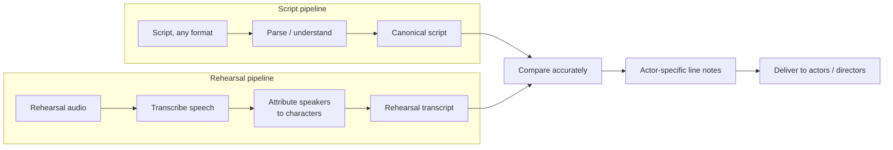
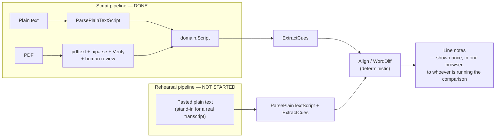
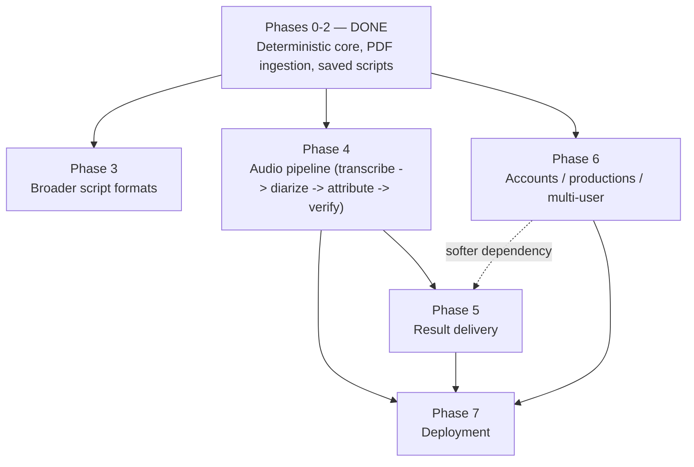

# Stage Assist — Product Roadmap

This document exists to keep implementation work honest against the
actual product vision. `CLAUDE.md` documents how the system is built and
why; this document explains *what problem it's for*, how far along that
problem is actually solved, and what's really left — organized by
product milestone, not by code module.

## 1. The problem this replaces

In many theater productions, a member of the backstage staff (often a
stage manager or assistant) does this by hand, every rehearsal:

1. Records the rehearsal.
2. Listens back to the *entire* recording, start to finish.
3. Compares what was actually said against the script, line by line, per
   actor.
4. Writes line notes — who dropped a line, who paraphrased, who added
   something that isn't in the script.
5. Delivers those notes to the actors, usually by email, before the next
   rehearsal.

The pain isn't that this is hard to do conceptually — it's that it's
slow, repetitive, and doesn't scale. A two-hour rehearsal takes at least
two hours to review this way, every single time, for the run of the
whole show. That's the actual thing being automated. Everything else in
this document is in service of eliminating that specific bottleneck.

## 2. The vision

Two independent problems — understanding the script, and understanding
the rehearsal — feed one comparison, which feeds one delivery step. The
important framing, worth repeating because it's easy to lose sight of
while writing code: **the rehearsal transcript is not the product, it's
an intermediate representation.** So is AI-assisted PDF parsing. The
product is fast, accurate, trustworthy line notes reaching an actor
before their next rehearsal, without anyone having to re-listen to two
hours of audio to produce them.

## 3. Where things actually stand today

The honest read of this diagram: **everything built so far is on the
script side and the comparison side.** The rehearsal side — the actual
"stop making a human listen to two hours of audio" problem this project
exists to solve — hasn't been started. It's currently stubbed out by
asking a human to paste in a transcript as plain text, which is a
reasonable placeholder for building and proving the comparison engine,
but it is not a step toward the real input source. That's not a
criticism of the work done — the comparison engine and the script side
were both necessary and both hard — it's just important not to read
"lots of code exists" as "lots of the hard product problem is solved."

## 4. The major technical challenges, and why each one exists

### Challenge A — Understand a script regardless of format
**Why it exists:** real scripts arrive as plain text, PDFs with wildly
different layouts, Final Draft (`.fdx`) files, Fountain files, Word
docs, scanned pages, and hand-annotated drafts. A tool that only accepts
one clean format isn't usable by a real production.
**Status: substantially solved for two formats.** Plain-text (a fixed
colon convention, deterministic) and PDF (AI-assisted, grounded against
the source, human-reviewed before use) both work today, converging on
one canonical `domain.Script`. Other formats are unstarted but the
architecture was specifically built so adding one doesn't touch anything
downstream (see `CLAUDE.md`'s parsing/comparison boundary).

### Challenge B — Turn rehearsal audio into a usable transcript
**Why it exists:** this is the actual data source the whole product
needs, and it's not one problem, it's at least three stacked ones:

- **Speech-to-text.** Turning audio into words. Largely a solved,
  mature technology category (existing ASR APIs) — this is closer to
  "pick and integrate a well-benchmarked tool" than "solve a novel
  problem," though theatrical delivery (period language, actors moving
  around a stage, overlapping dialogue, imperfect mic setups) is
  harder than a clean studio recording.
- **Speaker diarization.** Segmenting the audio by *who* is talking,
  without yet knowing which character that is. Also a fairly mature
  problem for off-the-shelf tools, in reasonable audio conditions.
- **Character attribution.** Mapping an anonymous "Speaker 2" to "the
  actor playing Hamlet." **This is the genuinely unsolved piece** — no
  off-the-shelf API does this out of the box. It likely needs either a
  one-time manual calibration step per rehearsal (a human labels each
  voice once) or a heuristic that matches transcribed content against
  expected script dialogue to infer identity — which is the same
  "ground a candidate against a known source" pattern already built for
  PDF grounding, applied to a much noisier input.
- **Filtering non-performance audio.** A director breaking in, actors
  discussing blocking, someone saying "let's take it from the top" —
  none of that is a line deviation and all of it needs to be recognized
  and excluded, not scored as a mistake.

**Status: not started.** This is the single biggest remaining piece of
the actual product vision, and the one with the least existing
Anthropic/industry off-the-shelf coverage (specifically the character-
attribution part).

### Challenge C — Compare a script and a transcript accurately
**Why it exists:** naive line-by-line diffing breaks immediately —
actors drop lines, add lines, paraphrase, and reorder. A useful tool
needs to tell "this was cut" apart from "this was said differently" and
get that right most of the time.
**Status: solved, and the strongest part of the system.** The
deterministic LCS-based alignment engine (`internal/domain`) handles
this with real, tested nuance (paraphrase pairing, consecutive
drops/adds), and its known limitations are pinned by name in tests
rather than silently wrong. This is genuinely production-grade work
already.

### Challenge D — Trust AI output without letting it corrupt results
**Why it exists:** the product's entire value depends on an actor
trusting a note that says "you got this line wrong." If an AI step
silently fabricates or misclassifies something, that's not a minor bug —
it actively damages the one thing the product is selling: a
trustworthy second opinion.
**Status: solved for PDF parsing, and the pattern is reusable.** The
grounding/verification system (`aiparse.Verify`) plus mandatory human
review before anything is used downstream is exactly the shape this
needs. The important forward-looking point: **this same pattern has to
be rebuilt for the audio pipeline** — surfacing low-confidence
transcription or ambiguous character attribution for human review,
rather than silently guessing, the same way an unverified PDF line is
flagged today instead of trusted blindly.

### Challenge E — Deliver results to the people who need them
**Why it exists:** today, a line note only exists inside one browser
tab, in real time, for whoever happens to be running the comparison —
which just moves the bottleneck rather than removing it (someone still
has to be there watching, and still has to manually relay results to
actors).
**Status: not started.** No per-actor delivery, no director-facing
aggregate view across a whole cast, no persistence of comparison
results over time — only the underlying comparison itself.

### Challenge F — Persist and scale beyond one session
**Why it exists:** a real production runs for weeks, with a fixed
script, a full cast, and many rehearsals. The tool needs to model that,
not just "compare once and lose everything."
**Status: first slice done.** The saved-script library (SQLite) is
real, working persistence — but scoped to scripts only. Transcripts,
comparison history, actors, and productions as first-class concepts
don't exist yet.

### Challenge G — Model a real production's structure
**Why it exists:** theater has a natural hierarchy — a production (one
run of one show) has one script, a cast of actors mapped to characters,
and a sequence of rehearsals over time. None of that hierarchy exists in
the data model yet; today's app is single-user and single-comparison by
construction.
**Status: not started.**

## 5. What's been completed, mapped to these challenges

| Milestone | Challenge(s) it addresses |
|---|---|
| Canonical `domain.Script` model | A (the seam that makes multiple formats tractable at all) |
| Plain-text parsing | A (first format) |
| Deterministic alignment/diff engine | C (the hardest part of the whole pipeline, done well) |
| AI-assisted PDF parsing + grounding + review UI | A (second format) + D (the trust pattern to reuse for audio) |
| Saved script library (SQLite) | F (first slice, scripts only) |
| React comparison UI | E (today's version: single-user, single-session, in-browser only) |
| Testing discipline (unit, eval suite, real-API verification) | Not a milestone itself — the quality bar every future piece, especially the audio pipeline, needs to keep meeting |

Notice what's absent from this table: nothing here touches Challenge B
(audio) at all. That's the honest state of the project relative to its
own stated vision.

## 6. Phases for the remaining work

- **Phase 3 — Broader script formats.** Fountain (plain text, a natural
  second deterministic parser), and worth validating directly with a
  real theater contact: is Final Draft's `.fdx` format actually more
  common in practice than plain PDFs? Also: whole-script (not
  excerpt-only) PDF import via chunking. Independent of Phase 4 — can
  happen in parallel, blocked only by Phase 0-2's existing architecture
  (already true today).
- **Phase 4 — the audio pipeline.** The core remaining problem
  (Challenge B), staged as transcription → diarization → character
  attribution → verification/review, each step producing a reviewable
  artifact for the next, mirroring the PDF pipeline's tiered-trust
  design. This should get a research spike before a full design,
  specifically on character attribution — the one piece with no
  off-the-shelf answer (the same way the PDF library choice got an
  actual spike, not just documentation research, before committing).
- **Phase 5 — Result delivery.** Needs Phase 4 to have real transcripts
  worth delivering notes about, and benefits from — but doesn't strictly
  require — Phase 6 (a simple shareable link can precede real accounts).
- **Phase 6 — Accounts and production structure.** Can start in
  parallel with Phases 3-4; doesn't block them. Meaningfully improves
  Phase 5 once it exists (knowing who an actor actually is, not just a
  link).
- **Phase 7 — Deployment.** Blocked on having something worth deploying
  for actual outside use — realistically after Phase 4 produces a
  working (even rough) audio pipeline, since that's the point where
  someone other than the developer could get real value. Worth an
  explicit product decision: deploy a rough MVP early to get real
  feedback from an actual theater group, or keep building in private
  longer? That's a strategy call, not a technical one.

## 7. MVP vs. long-term

The uncomfortable, useful truth from this exercise: **everything built
so far is necessary but not sufficient for the MVP.** The script side and
the comparison engine had to exist, but without Phase 4, a real user
still has to do the one thing this product exists to eliminate —
manually turning rehearsal audio into text — before Stage Assist can
help them at all.

**MVP, honestly defined:** Phase 4 (even a rough version — a manual
one-time speaker-labeling step is an acceptable MVP shortcut for
character attribution) plus the simplest possible delivery (a shareable
link is enough; email/notifications can wait), tried with one real
production. That's the smallest version of the thing that actually
removes the bottleneck described in section 1.

**Genuinely long-term, not MVP:**
- Full accounts/multi-production support (a real multi-tenant product,
  not one theater group's tool).
- Broader script format coverage beyond one or two formats.
- Semantic line-pairing (already flagged in the README) — a Claude-
  assisted second opinion on the alignment engine's known-ambiguous
  cases, never a replacement for it.
- Claude-authored note phrasing (turning a diff into a friendly
  sentence for an actor) — narration, not decision-making.
- Real-time/live monitoring during a rehearsal, rather than after the
  fact.

## 8. Where deterministic logic and AI each belong

This project already has a working principle for this
(`CLAUDE.md`'s "Deterministic core") — it just needs to be applied
deliberately as the audio pipeline gets built, not just left as a rule
about the code that already exists.

**Must stay deterministic — this is the trust foundation of the whole
product:**
- Whether a line matches, and how it differs. Already true, must stay
  true. An actor has to be able to trust that "you got this wrong" is a
  reproducible fact, not a probabilistic guess.

**Mature, well-benchmarked ML — different risk category from
generative AI, more like "a library" than "a judgment call":**
- Speech-to-text transcription itself. Real error rates, but a solved
  problem category, not a fuzzy one.

**Where Claude specifically belongs — genuine judgment calls that need
grounding and review, exactly like PDF parsing today:**
- Interpreting inconsistently-formatted source material into structure
  (already true for PDFs; likely true again for cleaning up raw ASR
  output).
- Character-attribution disambiguation in ambiguous cases — matching
  candidate speech against expected nearby script lines, the same
  grounding instinct already built, aimed at a noisier problem.
- Eventually, note phrasing — narrating a result the deterministic
  engine already produced.

**Where AI must never go, as a hard guardrail going forward:**
- Deciding whether an actor got a line right. That decision must always
  trace back to the deterministic comparison engine, full stop, no
  matter how good future models get.

## 9. Risks and unknowns worth naming now

- **Character attribution has no off-the-shelf solution.** This is the
  single biggest risk in the whole roadmap and deserves a real spike,
  not just a design doc, before committing to an approach.
- **Off-book rehearsals are a real scoping question, not just a data
  quality issue.** Early rehearsals are often deliberately not
  word-perfect (actors are still learning lines). Running this tool from
  day one could produce mostly noise. It may be right to explicitly
  scope this at *late-stage* rehearsals (closer to tech/dress), and
  that's a product decision worth making on purpose, not discovering by
  accident.
- **Audio conditions vary a lot in real rehearsal spaces** — background
  noise, actors moving relative to a mic, overlapping dialogue. Needs
  validating against a real recording from a real rehearsal before
  committing to an ASR/diarization approach.
- **Cost profile changes substantially.** A multi-hour rehearsal
  recording is a very different cost shape than a short PDF excerpt.
  The usage-tracking work already done is the right foundation to
  extend here, but the actual numbers need modeling before committing.
- **Turnaround time is part of the actual requirement**, not a nice-to-
  have — the value proposition is "notes before the next rehearsal." If
  processing a rehearsal takes longer than the gap between rehearsals,
  the product hasn't actually solved the problem.
- **Consent and privacy become real once actual actors' rehearsals go
  through third-party AI services** — a business/legal consideration
  that doesn't exist for the current all-local, text-only version.
- **The format assumptions may not match real practice.** Worth
  validating directly with a real theater contact whether PDFs and
  plain text are actually what shows up in practice, versus Final
  Draft files, Word docs, or annotated hand-me-down scripts.

## 10. What this means for right now

Nothing here says "stop and rebuild everything." It says: the next
highest-leverage investment is a research spike into audio transcription
and (especially) character attribution — the one problem this whole
roadmap depends on that has no existing solution to lean on — rather
than continuing to round out the script-ingestion side, which is already
comparatively mature. Format coverage, persistence polish, and accounts
are all real, but they're not what's standing between this project and
its actual stated vision.
